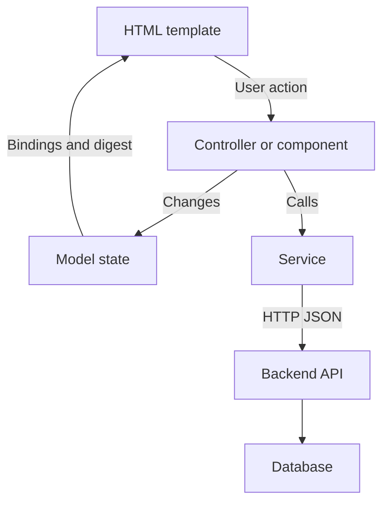
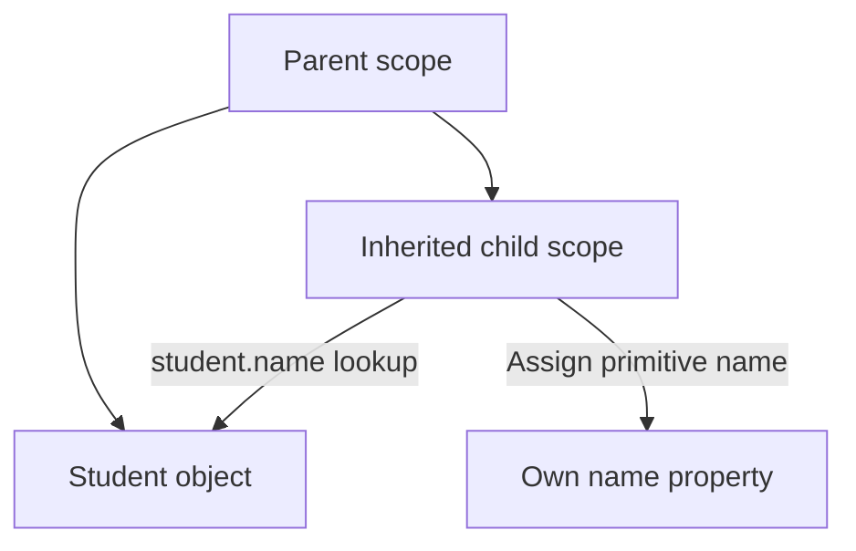
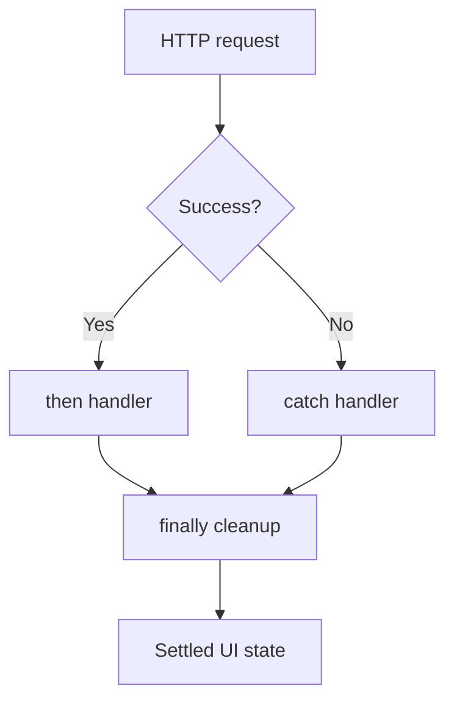
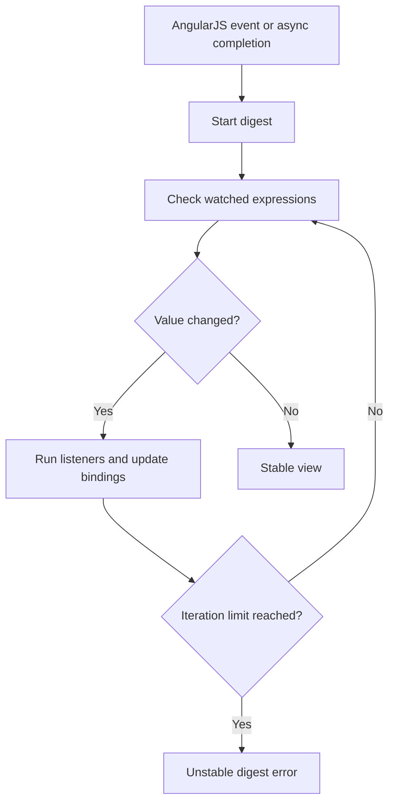
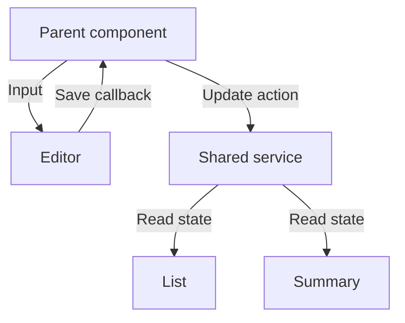
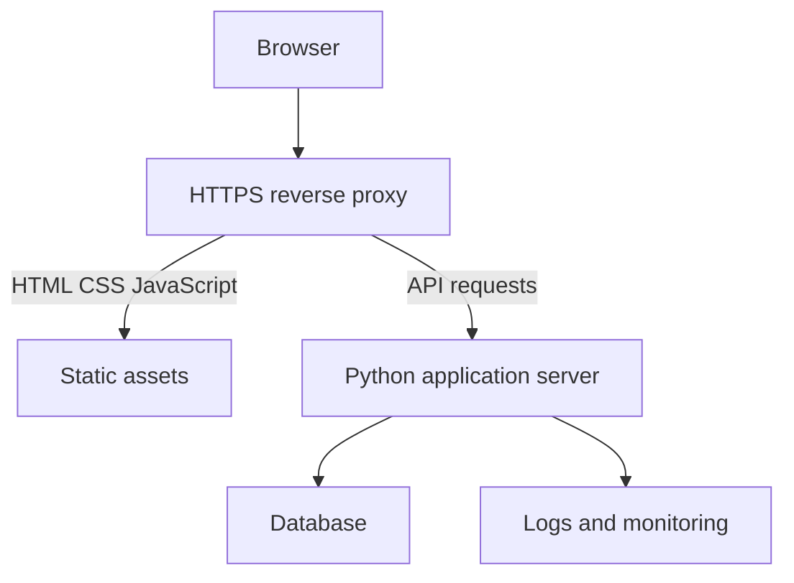
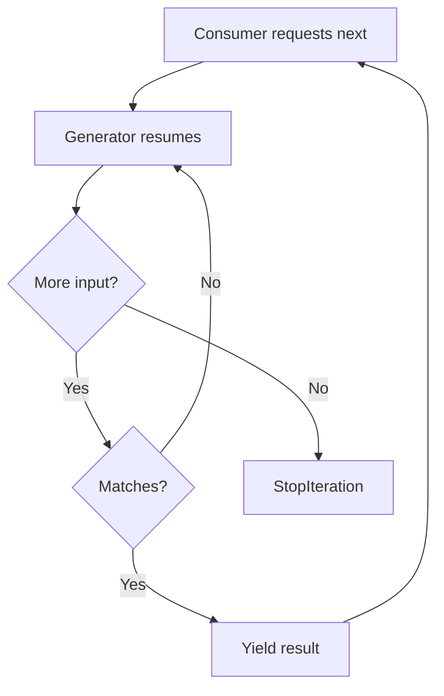
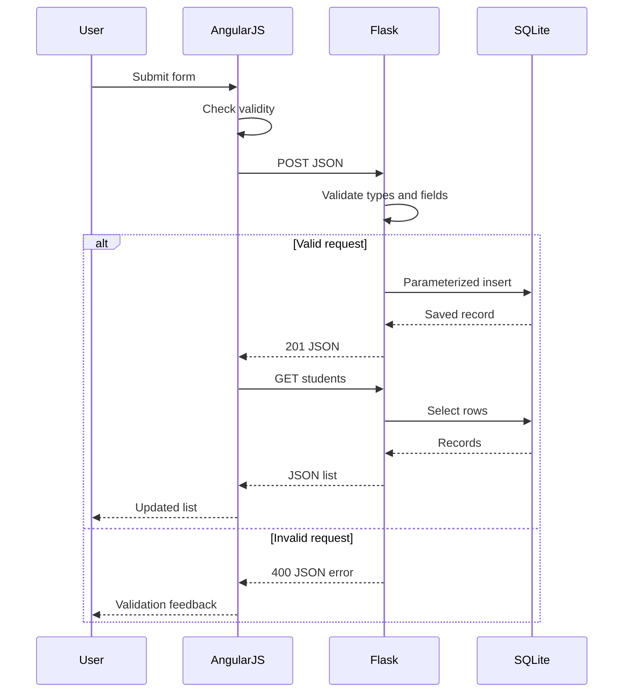

# AngularJS

## Contents

- [1. Web foundations and JavaScript prerequisites](#1-web-foundations-and-javascript-prerequisites)
- [2. What AngularJS is and how it works](#2-what-angularjs-is-and-how-it-works)
- [3. Setup and first complete program](#3-setup-and-first-complete-program)
- [4. Modules, dependency modules, and bootstrap](#4-modules-dependency-modules-and-bootstrap)
- [5. Expressions and binding](#5-expressions-and-binding)
- [6. Controllers, scope hierarchy, and the dot rule](#6-controllers-scope-hierarchy-and-the-dot-rule)
- [7. Built-in directives and events](#7-built-in-directives-and-events)
- [8. Filters and derived data](#8-filters-and-derived-data)
- [9. Forms, validation, and ngModel](#9-forms-validation-and-ngmodel)
- [10. Dependency injection, services, factories, and providers](#10-dependency-injection-services-factories-and-providers)
- [11. HTTP, promises, cancellation, and stale responses](#11-http-promises-cancellation-and-stale-responses)
- [12. Routing with ngRoute](#12-routing-with-ngroute)
- [13. Digest cycle and watchers](#13-digest-cycle-and-watchers)
- [14. Custom directives, compile, and link](#14-custom-directives-compile-and-link)
- [15. Components, bindings, and lifecycle](#15-components-bindings-and-lifecycle)
- [16. Transclusion and communication](#16-transclusion-and-communication)
- [17. Interceptors, caching, and API contracts](#17-interceptors-caching-and-api-contracts)
- [18. Security, authentication, CSRF, and CORS](#18-security-authentication-csrf-and-cors)
- [19. Performance and memory management](#19-performance-and-memory-management)
- [20. Browser storage and serialization](#20-browser-storage-and-serialization)
- [21. Animation, templates, localization, and accessibility](#21-animation-templates-localization-and-accessibility)
- [22. Testing AngularJS](#22-testing-angularjs)
- [23. Project organization and maintainability](#23-project-organization-and-maintainability)
- [24. Deployment and migration](#24-deployment-and-migration)
- [25. Complete project A — In-memory student manager](#25-complete-project-a--in-memory-student-manager)
- [26. Python foundations and object references](#26-python-foundations-and-object-references)
- [27. Iterators, generators, and lazy processing](#27-iterators-generators-and-lazy-processing)
- [28. Closures, decorators, and caching](#28-closures-decorators-and-caching)
- [29. Context managers, exceptions, files, and logging](#29-context-managers-exceptions-files-and-logging)
- [30. OOP, dataclasses, typing, and protocols](#30-oop-dataclasses-typing-and-protocols)
- [31. Descriptors, special methods, and metaprogramming](#31-descriptors-special-methods-and-metaprogramming)
- [32. Asyncio, threads, processes, and cancellation](#32-asyncio-threads-processes-and-cancellation)
- [33. Environments, testing, SQL, and backend architecture](#33-environments-testing-sql-and-backend-architecture)
- [34. Complete project B — AngularJS, Flask, and SQLite](#34-complete-project-b--angularjs-flask-and-sqlite)
- [35. Common errors and troubleshooting](#35-common-errors-and-troubleshooting)
- [36. Interview questions and answers](#36-interview-questions-and-answers)
- [37. Practice tasks and learning plan](#37-practice-tasks-and-learning-plan)
- [38. Quick reference and official resources](#38-quick-reference-and-official-resources)

---

## 1. Web foundations and JavaScript prerequisites

A browser loads HTML for structure, CSS for appearance, JavaScript for behavior, and API data for content. The DOM is the browser's object representation of HTML. Application **state** is the current data: selected record, form values, loading state, and errors.

A single-page application keeps its document loaded while JavaScript changes the displayed views. It can still make many network requests. A client route such as `#!/students/12` and a server endpoint such as `/api/students/12` serve different purposes.

| Term | Meaning | Example |
|---|---|---|
| Client | Browser/frontend | AngularJS student form |
| Server | Program receiving requests | Flask application |
| HTTP method | Requested operation | GET, POST, PATCH, DELETE |
| JSON | Text representation of structured data | `{"name":"Ajay","marks":84}` |
| Endpoint | API URL handling an operation | `/api/students` |
| Database | Persistent organized data | SQLite or PostgreSQL |

### JavaScript recap

```javascript
var students = [
  {id: 1, name: 'Ajay', marks: 84},
  {id: 2, name: 'Harshada', marks: 91}
];
function grade(marks) {
  if (marks >= 75) return 'Distinction';
  if (marks >= 40) return 'Pass';
  return 'Fail';
}
var names = students.map(function (s) { return s.name; });
var passed = students.filter(function (s) { return s.marks >= 40; });
var total = students.reduce(function (sum, s) { return sum + s.marks; }, 0);
console.log(names, total, grade(84));
// ['Ajay', 'Harshada'], 175, 'Distinction'
```

Understand objects, arrays, functions, closures, lexical scope, callbacks, promises, `this`, and JSON before advanced AngularJS. Objects are assigned by reference: editing one reference can change data seen through another. `angular.copy(record)` creates an independent editable draft for ordinary data objects.

Ordinary functions are used for AngularJS constructors. An arrow function does not provide the same constructor/`this` behavior.

## 2. What AngularJS is and how it works

AngularJS adds declarative templates, dependency injection, bindings, controllers, services, and reusable components to browser applications. A directive such as `ng-repeat` gives meaning to an HTML attribute. An expression such as `{{ vm.name }}` displays model state.

| Dimension | AngularJS 1.x | Modern Angular |
|---|---|---|
| Typical language | JavaScript | TypeScript |
| Module/bootstrap API | `angular.module()` and AngularJS bootstrap | Different modern APIs |
| Common template syntax | `ng-model`, `ng-repeat` | Different binding/control-flow syntax |
| Architecture | Controllers/scopes; later components | Component-centered |
| Change detection | Digest and watchers | Different implementation/reactive facilities |
| Official support | Ended January 2022 | Separate actively developed project |

Do not treat `ng new`, `@Component`, or modern Angular `HttpClient` as AngularJS APIs.



The template displays state; the controller coordinates interactions; a service shares reusable logic/data access. The server validates requests and controls database access. Browser code must never contain database credentials.

AngularJS is described with MVC/MVVM terminology. The practical goal is separation of presentation, interaction logic, and persistence.

## 3. Setup and first complete program

You need an editor, browser, and local HTTP server. Node.js is not required for a simple AngularJS page. Save this as **`index.html`**:

```html
<!doctype html>
<html lang="en" ng-app="studyApp" ng-strict-di>
<head>
  <meta charset="utf-8">
  <meta name="viewport" content="width=device-width, initial-scale=1">
  <title>First AngularJS Program</title>
  <style>[ng-cloak] { display: none !important; }</style>
</head>
<body ng-controller="HelloController as vm" ng-cloak>
  <h1>Hello, {{ vm.name }}!</h1>
  <label>Your name <input ng-model="vm.name"></label>
  <p>Characters: {{ vm.name.length }}</p>
  <button type="button" ng-click="vm.reset()">Reset</button>
  <script src="https://ajax.googleapis.com/ajax/libs/angularjs/1.8.2/angular.min.js"></script>
  <script>
    angular.module('studyApp', []).controller('HelloController', function () {
      var vm = this;
      vm.name = 'Student';
      vm.reset = function () { vm.name = 'Student'; };
    });
  </script>
</body>
</html>
```

Run from the file's folder:

```bash
python3 -m http.server 8000 --bind 127.0.0.1
```

Open `http://127.0.0.1:8000`. On Windows, `py -m http.server 8000 --bind 127.0.0.1` is an alternative with the Python launcher.

**Expected:** The heading initially says “Hello, Student!”. Typing updates it immediately. Reset restores the initial name.

| Syntax | Role |
|---|---|
| `ng-app="studyApp"` | Select root module |
| `ng-strict-di` | Require annotation for injected parameters |
| `HelloController as vm` | Expose controller instance using `vm` |
| `ng-model` | Connect control and state |
| `ng-click` | Handle click |
| `ng-cloak` with CSS | Hide uncompiled template text |

The CDN requires internet access. For offline work, keep approved pinned copies under `vendor/` and change script paths. Load AngularJS first, optional framework modules second, your module definition third, and other registrations afterward.

## 4. Modules, dependency modules, and bootstrap

A module groups registrations and declares dependencies. It is not an ES module or a mechanism for fetching JavaScript files.

```javascript
angular.module('studyApp', []); // Create once
angular.module('studyApp').controller('PageController', function () {
  this.title = 'Student Portal';
}); // Retrieve and register afterward
```

Recreating a module with the dependency array can discard earlier registrations. Use the one-argument retrieval form after its definition.

```javascript
angular.module('students', []);
angular.module('shared', []);
angular.module('studyApp', ['students', 'shared']);
```

Every dependency must be defined before bootstrap. File splitting does not automatically load files.

### Config and run

```javascript
angular.module('studyApp')
  .constant('API_BASE', '/api')
  .config(['$httpProvider', function ($httpProvider) {
    $httpProvider.useApplyAsync(true);
  }])
  .run(['$log', function ($log) {
    $log.info('Application started');
  }]);
```

Config blocks configure providers before ordinary runtime services are used. Providers and constants can be injected into config; `$http` cannot. Run blocks execute after configuration and can receive service instances.

### Manual bootstrap

```javascript
angular.element(document).ready(function () {
  angular.bootstrap(document, ['studyApp'], {strictDi: true});
});
```

Remove `ng-app` for the same root when manually bootstrapping. Never bootstrap the same DOM root twice. Manual bootstrap can wait for necessary startup preparation.

## 5. Expressions and binding

Expressions evaluate against template context and should contain small display decisions, not complex business operations. They are not unrestricted JavaScript programs.

```html
<p>{{ 10 + 20 }}</p>
<p>{{ vm.student.name }}</p>
<p>{{ vm.marks >= 40 ? 'Pass' : 'Fail' }}</p>
<p ng-bind="vm.message"></p>
<input ng-model="vm.message">
<p>Permanent ID: {{ ::vm.id }}</p>
```

| Form | Meaning |
|---|---|
| Interpolation | Reevaluate and display an expression |
| `ng-bind` | Write text without displaying raw interpolation initially |
| `ng-model` | Synchronize a supported form control and model |
| `::` | One-time binding after its value stabilizes as defined |
| Component `<` | Parent-to-child input binding |

One-time binding suits immutable IDs, not changing counters. Input two-way binding does not imply that all application objects should be shared and mutable.

Ordinary text binding does not intentionally compile the text into a new AngularJS template. Never feed user input into `$compile`; AngularJS expressions are not a security sandbox.

## 6. Controllers, scope hierarchy, and the dot rule

Controllers initialize state and expose user actions. Put reusable rules and network calls in services; put DOM behavior in directives.

```javascript
angular.module('studyApp').controller('MarksController', function () {
  var vm = this;
  vm.student = {name: 'Ajay', marks: 75};
  vm.increase = function () {
    vm.student.marks = Math.min(100, vm.student.marks + 1);
  };
});
```

```html
<section ng-controller="MarksController as vm">
  <p>{{ vm.student.name }}: {{ vm.student.marks }}</p>
  <button ng-click="vm.increase()">Increase</button>
</section>
```

Legacy `$scope` syntax:

```javascript
angular.module('studyApp').controller('LegacyController', ['$scope', function ($scope) {
  $scope.student = {name: 'Ajay'};
  $scope.rename = function () { $scope.student.name = 'Student'; };
}]);
```

Scopes provide expression context and change-observation APIs. Many child scopes prototypically inherit from their parent; isolate scopes do not inherit application properties that way. [Official scopes guide](https://docs.angularjs.org/guide/scope)

If a child assigns a primitive `name`, it can create its own property, hiding the parent's property. A dotted model such as `student.name` usually updates the referenced object's property. `controllerAs` encourages this pattern.



This avoids an accidental shadowing problem but does not replace explicit state ownership.

## 7. Built-in directives and events

| Directive | Purpose | Example |
|---|---|---|
| `ng-repeat` | Repeat records | `s in vm.students track by s.id` |
| `ng-if` | Create/destroy subtree | `ng-if="vm.ready"` |
| `ng-show`, `ng-hide` | Toggle visibility | `ng-show="vm.ready"` |
| `ng-class` | Conditional classes | `ng-class="{pass: s.marks >= 40}"` |
| `ng-style` | Style object | `ng-style="vm.styles"` |
| `ng-disabled` | Disable control | `ng-disabled="vm.saving"` |
| `ng-submit` | Form submit action | `ng-submit="vm.save(form)"` |
| `ng-change` | Committed input change | `ng-change="vm.search()"` |
| `ng-switch` | Choose a case | `ng-switch="vm.status"` |
| `ng-include` | Include a template | `ng-include="'header.html'"` |
| `ng-src`, `ng-href` | Delay URL evaluation until binding | `ng-src="{{ vm.photo }}"` |

```html
<ul>
  <li ng-repeat="s in vm.students track by s.id">
    {{ $index + 1 }}. {{ s.name }}
    <span ng-if="$first">First</span>
    <span ng-if="$last">Last</span>
  </li>
</ul>
```

Stable IDs preserve row identity. `$index` tracks position and can reuse the wrong control state when items move. Duplicate tracking keys cause errors.

| Question | `ng-if` | `ng-show` |
|---|---|---|
| Hidden content in DOM? | No | Yes |
| Recreated when shown? | Yes | No |
| Hidden subtree watchers? | Removed with scope destruction | Usually remain |
| Local form state retained? | May reset | Usually retained |
| Security boundary? | No | No |

```html
<button ng-click="vm.inspect($event)">Inspect</button>
```

`$event` provides the browser event. Use buttons for actions, anchors for navigation, labels for inputs, and accessible feedback. A click handler alone does not make an arbitrary element keyboard accessible.

## 8. Filters and derived data

Filters transform values for display. They should be inexpensive and deterministic.

```html
<p>{{ vm.name | uppercase }}</p>
<p>{{ vm.name | lowercase }}</p>
<p>{{ vm.fee | currency:'₹':2 }}</p>
<p>{{ vm.average | number:1 }}</p>
<p>{{ vm.createdAt | date:'dd MMM yyyy' }}</p>
<pre>{{ vm.student | json }}</pre>
<div ng-repeat="s in vm.students | filter:{name: vm.query} | orderBy:'name' | limitTo:10 track by s.id">
  {{ s.name }}
</div>
```

This filtering and limiting happens in the browser; it is not database pagination. Large collections should be filtered and paginated by the server.

```javascript
angular.module('studyApp').filter('gradeLabel', function () {
  return function (marks) {
    if (typeof marks !== 'number' || !isFinite(marks)) return 'Unknown';
    if (marks >= 75) return 'Distinction';
    if (marks >= 60) return 'First class';
    if (marks >= 40) return 'Pass';
    return 'Fail';
  };
});
```

Use `{{ vm.marks | gradeLabel }}`. Never start API calls from filters. Precompute expensive derived values when their source changes rather than traversing large collections repeatedly in template functions.

## 9. Forms, validation, and ngModel

Forms track validity and interaction state. Browser validation improves usability; repeat data and permission validation on the server.

| Property | Meaning |
|---|---|
| `$pristine` / `$dirty` | Unchanged / changed through a control |
| `$untouched` / `$touched` | Not blurred / has been blurred |
| `$valid` / `$invalid` | Validation succeeds / fails |
| `$pending` | Asynchronous validation in progress |
| `$error` | Failed validator keys |
| `$submitted` | Form was submitted |

```html
<form name="studentForm" ng-submit="vm.register(studentForm)" novalidate>
  <label>Name
    <input name="name" ng-model="vm.student.name" required ng-minlength="2" ng-maxlength="60">
  </label>
  <p ng-if="(studentForm.name.$touched || studentForm.$submitted) && studentForm.name.$invalid">
    Enter a name with 2–60 characters.
  </p>
  <label>Email
    <input type="email" name="email" ng-model="vm.student.email" required>
  </label>
  <p ng-if="studentForm.email.$touched && studentForm.email.$invalid">Enter a valid email.</p>
  <label>Age
    <input type="number" name="age" ng-model="vm.student.age" min="18" max="50" required>
  </label>
  <label>Course
    <select ng-model="vm.student.courseId" ng-options="c.id as c.name for c in vm.courses" required>
      <option value="">Choose course</option>
    </select>
  </label>
  <label><input type="checkbox" ng-model="vm.student.accepted" required> Accept terms</label>
  <button type="submit" ng-disabled="vm.saving || studentForm.$pending">Register</button>
  <p role="status">{{ vm.message }}</p>
</form>
```

```javascript
// Inside the owning controller:
vm.student = {};
vm.courses = [{id: 1, name: 'M.Sc. CA'}, {id: 2, name: 'B.Sc. CS'}];
vm.register = function (form) {
  if (form.$invalid || form.$pending) return;
  vm.message = 'Valid locally; send to the server for validation and saving.';
};
```

`novalidate` disables native browser submission feedback, not AngularJS validation. Real names can contain non-ASCII characters, spaces, apostrophes, and hyphens; avoid arbitrary restrictive name regexes for general international forms.

### Debounce

```html
<input ng-model="vm.query" ng-model-options="{debounce: 300}" ng-change="vm.search()">
```

Debounce delays model commits while typing. `updateOn: 'blur'` commits on blur. `$rollbackViewValue()` can cancel pending view updates when resetting a debounced control.

### Custom validator

```javascript
angular.module('studyApp').directive('evenNumber', function () {
  return {
    require: 'ngModel',
    link: function (scope, element, attrs, ctrl) {
      ctrl.$validators.evenNumber = function (modelValue, viewValue) {
        if (ctrl.$isEmpty(viewValue)) return true;
        return typeof modelValue === 'number' && modelValue % 2 === 0;
      };
    }
  };
});
```

Use `<input type="number" ng-model="vm.count" even-number required>`. The `required` validator handles emptiness. `$parsers` transform view-to-model values, `$formatters` transform model-to-view values, `$validators` return booleans, and `$asyncValidators` return promises. Use validation APIs for validity rather than abusing parsers.

## 10. Dependency injection, services, factories, and providers

Dependency injection supplies collaborators rather than constructing them inside each controller. This improves reuse and makes test substitution straightforward.

```javascript
angular.module('studyApp').controller('ApiController', ['$http', 'API_BASE',
  function ($http, API_BASE) {
    this.load = function () { return $http.get(API_BASE + '/students'); };
  }
]);
```

Minifiers rename parameters. Inline arrays preserve service names. Alternatively:

```javascript
function StudentController(StudentApi) { this.api = StudentApi; }
StudentController.$inject = ['StudentApi'];
angular.module('studyApp').controller('StudentController', StudentController);
```

| Registration | What it accepts | Typical use |
|---|---|---|
| `.constant` | Config/runtime value | API base |
| `.value` | Runtime value | Runtime settings |
| `.factory` | Function returning service | API wrapper |
| `.service` | Constructor | Object with methods |
| `.provider` | Configurable provider and `$get` | Startup-configurable library |

Instances are normally shared singletons **per injector**, created when needed. A registered constant object is not automatically frozen.

```javascript
angular.module('studyApp')
  .factory('GradeService', function () {
    return {isPass: function (marks) { return marks >= 40; }};
  })
  .service('CounterService', function () {
    this.value = 0;
    this.increment = function () { this.value += 1; };
  });

angular.module('studyApp').provider('Greeting', function () {
  var prefix = 'Hello';
  this.setPrefix = function (value) { prefix = value; };
  this.$get = function () {
    return {say: function (name) { return prefix + ', ' + name; }};
  };
});
angular.module('studyApp').config(['GreetingProvider', function (GreetingProvider) {
  GreetingProvider.setPrefix('Welcome');
}]);
```

Inject `GreetingProvider` during config and `Greeting` during runtime. Avoid circular service dependencies; they usually indicate responsibilities need to be separated.

## 11. HTTP, promises, cancellation, and stale responses

`$http` returns a promise whose response contains `data`, `status`, headers access, and configuration. Old `.success()`/`.error()` APIs are removed; use `.then()`, `.catch()`, and `.finally()`.

```javascript
angular.module('studyApp').factory('StudentApi', ['$http', function ($http) {
  return {
    list: function (query) {
      return $http.get('/api/students', {params: {q: query || ''}})
        .then(function (response) { return response.data; });
    },
    create: function (student) { return $http.post('/api/students', student); },
    update: function (id, changes) {
      return $http.patch('/api/students/' + encodeURIComponent(id), changes);
    },
    remove: function (id) {
      return $http.delete('/api/students/' + encodeURIComponent(id));
    }
  };
}]);
```

GET retrieves; POST creates; PATCH updates selected fields; PUT commonly replaces; DELETE removes. Your backend defines the exact contract.

```javascript
angular.module('studyApp').controller('ListController', ['StudentApi', function (StudentApi) {
  var vm = this;
  var latestRequest = 0;
  vm.students = [];
  vm.load = function () {
    var requestId = ++latestRequest;
    vm.loading = true;
    vm.error = '';
    return StudentApi.list(vm.query).then(function (rows) {
      if (requestId === latestRequest) vm.students = rows;
    }).catch(function () {
      if (requestId === latestRequest) vm.error = 'Could not load students.';
    }).finally(function () {
      if (requestId === latestRequest) vm.loading = false;
    });
  };
  vm.load();
}]);
```

A slow old search must not overwrite a newer result. The sequence number above ignores stale responses; it does not abort requests.



Return a value from `then` to transform the next result; return a promise to chain work. Throwing preserves failure. A normal return from `catch` converts failure into success, so do it intentionally.

```javascript
// Inside a function injected with $q and $http:
$q.all({students: $http.get('/api/students'), courses: $http.get('/api/courses')})
  .then(function (results) { console.log(results.students.data, results.courses.data); });

var canceller = $q.defer();
$http.get('/api/search', {timeout: canceller.promise}).catch(function (error) {
  if (error.xhrStatus !== 'abort') console.error('Search failed');
});
canceller.resolve();
```

Use `$q.defer()` when needed for adapting an API/cancellation, not to wrap every existing promise. `$q` and `$http` integrate with the digest.

## 12. Routing with ngRoute

Routing maps browser locations to views. Load `angular-route.min.js` version 1.8.2 after AngularJS. This separate exercise creates a module with `ngRoute`:

```html
<script src="https://ajax.googleapis.com/ajax/libs/angularjs/1.8.2/angular.min.js"></script>
<script src="https://ajax.googleapis.com/ajax/libs/angularjs/1.8.2/angular-route.min.js"></script>
```

```javascript
angular.module('studyApp', ['ngRoute'])
  .config(['$routeProvider', '$locationProvider', function ($routeProvider, $locationProvider) {
    $locationProvider.hashPrefix('!');
    $routeProvider
      .when('/students', {template: '<h2>Students</h2><a href="#!/students/12">Open 12</a>'})
      .when('/students/:id', {
        template: '<h2>Student {{ vm.id }}</h2>',
        controller: 'DetailController', controllerAs: 'vm'
      })
      .otherwise({redirectTo: '/students'});
  }])
  .controller('DetailController', ['$routeParams', function ($routeParams) {
    this.id = $routeParams.id;
  }]);
```

```html
<nav><a href="#!/students">Students</a></nav>
<main ng-view></main>
```

URL parameters are untrusted strings. Validate them and authorize record access on the server.

### Resolve before activation

```javascript
// Inside route configuration, with StudentApi registered:
$routeProvider.when('/directory', {
  template: '<p ng-repeat="s in vm.students track by s.id">{{ s.name }}</p>',
  controller: ['students', function (students) { this.students = students; }],
  controllerAs: 'vm',
  resolve: {
    students: ['StudentApi', function (StudentApi) { return StudentApi.list(); }]
  }
});
```

Handle `$routeChangeError` when a resolve fails. Route guards and redirects help navigation, but do not secure APIs.

Hash mode works with simple static hosting. HTML5 mode requires `<base href="/">` and server fallback for client routes. Exclude APIs and real assets from fallback or JavaScript requests may receive HTML. UI-Router is a separate library using states/nested views; do not mix its APIs with ngRoute accidentally.

## 13. Digest cycle and watchers

A digest evaluates watched expressions. Changes trigger listeners, which may change other watched values, so checks repeat until stable. AngularJS does not continuously poll all bindings on a fixed background interval.



The default repeat limit is 10 iterations. A watch returning a new object every time under identity comparison, or listeners changing each other endlessly, can cause an infinite-digest error.

```javascript
// Inside a controller injected with $scope:
var unwatch = $scope.$watch('vm.student.marks', function (next, previous) {
  if (next !== previous) console.log('Changed:', next);
});
var unwatchRows = $scope.$watchCollection('vm.students', function (rows) {
  console.log('Shallow collection change');
});
$scope.$on('$destroy', function () { unwatch(); unwatchRows(); });
```

| API | Observes | Cost |
|---|---|---|
| `$watch(expr, fn)` | Value or object identity | Lower |
| `$watchCollection` | Shallow collection changes | Moderate |
| `$watch(expr, fn, true)` | Deep equality | Higher |
| `$watchGroup` | Several expressions | Depends on expressions |

Watch functions should be stable and side-effect free. Prefer explicit derived-state updates over deep watches when practical.

| Method | Purpose |
|---|---|
| `$apply(fn)` | Execute external work, then root digest |
| `$digest()` | Check current scope and descendants; rarely call directly |
| `$evalAsync(fn)` | Queue work for digest processing; schedule digest if needed |
| `$applyAsync(fn)` | Batch work for a later apply/digest |

Normal AngularJS `ng-click`, `$http`, `$timeout` handlers already integrate with change detection. Wrapping them in another `$apply` can cause “digest already in progress”.

```javascript
// External callback; inside a controller with vm and injected $scope:
var timer = window.setTimeout(function () {
  $scope.$evalAsync(function () { vm.status = 'Updated'; });
}, 500);
$scope.$on('$destroy', function () { window.clearTimeout(timer); });
```

Native promises, `fetch`, or external event emitters may need a bridge. Use `$evalAsync` around the state update or adapt through `$q.when`.

## 14. Custom directives, compile, and link

Use directives for DOM behavior and browser/widget integration. JavaScript names are camelCase; HTML uses kebab-case.

```javascript
angular.module('studyApp').directive('focusOn', ['$timeout', function ($timeout) {
  return {
    restrict: 'A',
    scope: {focusOn: '<'},
    link: function (scope, element) {
      var pending;
      var stop = scope.$watch('focusOn', function (value) {
        if (pending) $timeout.cancel(pending);
        if (value) pending = $timeout(function () { element[0].focus(); });
      });
      scope.$on('$destroy', function () {
        stop();
        if (pending) $timeout.cancel(pending);
      });
    }
  };
}]);
```

Use `<input focus-on="vm.shouldFocus">` on a plain input for this exercise. Avoid putting multiple directives requiring isolate/new scopes on the same element.

| Option | Meaning |
|---|---|
| `restrict: 'E'` / `'A'` | Element / attribute directive |
| `template`, `templateUrl` | Inline / external template |
| `scope` | Scope configuration |
| `bindToController` | Put bindings on controller |
| `controllerAs` | Template alias |
| `require` | Get another directive controller, such as `ngModel` |
| `transclude` | Project caller content |
| `compile` | Prepare template; return link behavior |
| `link` | Connect an instance with scope and DOM |

Compile prepares the template/directives. Link operates on a live instance. A repeated template may be compiled once and linked for many instances. Pre-link generally runs parent before child, post-link child before parent. Async child templates can finish later. [Directive guide](https://docs.angularjs.org/guide/directive)

AngularJS includes jqLite, a small DOM utility, not all of jQuery. Access native DOM through `element[0]`.

```javascript
// Inside a directive link function:
function onClick() {
  scope.$evalAsync(function () { scope.clicked = true; });
}
element.on('click', onClick);
scope.$on('$destroy', function () { element.off('click', onClick); });
```

Remove global listeners, timers, observers, sockets, and widget instances when their owner disappears.

## 15. Components, bindings, and lifecycle

Components provide isolated reusable view units. Prefer components for screens/UI blocks and directives for lower-level DOM integration.

| Binding | Meaning | Caution |
|---|---|---|
| `@` | String/interpolated attribute | Not arbitrary object input |
| `<` | Parent-to-child input | Objects remain shared references |
| `=` | Two-way binding | Hidden coupling if overused |
| `&` | Parent expression callback | Match local argument keys |

```javascript
angular.module('studyApp').component('studentEditor', {
  bindings: {student: '<', onSave: '&'},
  template:
    '<form name="editorForm" ng-submit="$ctrl.save(editorForm)" novalidate>' +
      '<label>Name <input name="name" ng-model="$ctrl.draft.name" required></label>' +
      '<button type="submit">Save</button>' +
    '</form>',
  controller: function () {
    var ctrl = this;
    ctrl.$onChanges = function (changes) {
      if (changes.student) ctrl.draft = angular.copy(ctrl.student || {});
    };
    ctrl.save = function (form) {
      if (form.$invalid) return;
      ctrl.onSave({student: angular.copy(ctrl.draft)});
    };
  }
});
```

```html
<student-editor student="vm.selected" on-save="vm.save(student)"></student-editor>
```

The callback local `student` matches `onSave({student: ...})`. Editing the draft does not immediately change the parent. `<` alone does not clone objects or enforce deep immutability.

| Hook | Responsibility |
|---|---|
| `$onChanges(changes)` | React to `<`/`@` input changes, including initialization |
| `$onInit()` | Initialize after bindings are assigned |
| `$doCheck()` | Custom checking; keep inexpensive |
| `$postLink()` | Work after this component is linked |
| `$onDestroy()` | Cleanup |

Do not assume inputs exist in the constructor. `$onChanges` does not detect arbitrary deep mutation of an unchanged object reference. [Components guide](https://docs.angularjs.org/guide/component)

## 16. Transclusion and communication

Transclusion places caller content inside a reusable template while preserving the relevant caller scope context.

```javascript
angular.module('studyApp').component('panelBox', {
  transclude: true,
  bindings: {title: '@'},
  template: '<section><h2>{{$ctrl.title}}</h2><div ng-transclude></div></section>'
});
```

```html
<panel-box title="Student details"><p>{{ vm.student.name }}</p></panel-box>
```

| Relationship | Mechanism |
|---|---|
| Parent to child | `<` input |
| Child to parent | `&` callback |
| Siblings | Shared service with explicit actions |
| Legacy scope hierarchy notification | `$emit`, `$broadcast`, `$on` |



`$emit` travels upward; `$broadcast` downward; `$on` subscribes. Global event-heavy systems become difficult to trace. Clean up listeners placed on longer-lived scopes:

```javascript
// Inside controller injected with $rootScope and $scope:
var unsubscribe = $rootScope.$on('student:saved', function (event, student) {
  console.log(student.id);
});
$scope.$on('$destroy', unsubscribe);
```

## 17. Interceptors, caching, and API contracts

Interceptors handle cross-cutting HTTP behavior. Preserve failure unless recovery is intentional.

```javascript
angular.module('studyApp').factory('apiErrors', ['$q', function ($q) {
  return {
    responseError: function (response) {
      response.userMessage = response.status === 401
        ? 'Please sign in again.' : 'Request could not be completed.';
      return $q.reject(response);
    }
  };
}]);
angular.module('studyApp').config(['$httpProvider', function ($httpProvider) {
  $httpProvider.interceptors.push('apiErrors');
}]);
```

An interceptor can add headers, but only attach tokens to approved API destinations. Avoid logging credentials and avoid interceptor dependency cycles through `$http`.

```javascript
// Inject $cacheFactory and $http:
var cache = $cacheFactory('referenceData');
$http.get('/api/courses', {cache: cache});
// When mutation makes it stale:
cache.remove('/api/courses');
```

GET caching is opt-in. Include relevant query parameters in identity, invalidate after changes, clear user-specific state at logout, and do not cache sensitive information casually.

A paginated list contract can use:

```json
{"items":[{"id":1,"name":"Ajay"}],"page":1,"pageSize":20,"total":103}
```

The complete learning project later uses a plain array instead. Frontend and backend must agree on the response shape.

| Status | Typical meaning |
|---|---|
| 400 | Invalid input |
| 401 | Authentication missing/invalid |
| 403 | Not permitted |
| 404 | Resource missing |
| 409 | State conflict |
| 422 | Validation failure if the API uses it |
| 429 | Rate limit |
| 500 | Unexpected server error |

Network and CORS failures may not expose a readable status. Check browser and server evidence together.

## 18. Security, authentication, CSRF, and CORS

The browser is controlled by the user. Enforce authentication, authorization, ownership, and input validation at the backend. Hiding an admin button is not authorization.

### XSS and template injection

Render untrusted text through normal text binding. Never concatenate user input into templates or pass it to `$compile`. If HTML display is essential, use a reviewed sanitization design. `ngSanitize` is a separate module. `$sce.trustAsHtml()` marks trust; it does not sanitize content.

Frontend files cannot keep secrets. Database credentials, administrative keys, and server signing secrets belong on the server.

### Cookie sessions and CSRF

HttpOnly cookies cannot normally be read by JavaScript, but browsers still attach them to matching requests. Cookie authentication needs suitable CSRF protections. Configure `Secure`, `SameSite`, domain/path, HTTPS, and expiration deliberately.

AngularJS has conventional same-origin XSRF support using `XSRF-TOKEN` and `X-XSRF-TOKEN` by default. The server must issue and verify tokens. The header alone provides no security.

Tokens in browser storage can be read by injected scripts; localStorage is not universally secure authentication storage. Choose the complete authentication design based on deployment requirements.

### CORS

Origin includes scheme, host, and port. Ports 8000 and 5000 on localhost are different origins. CORS is browser-enforced permission to read cross-origin responses, not authentication.

Cross-origin cookie requests generally require `withCredentials: true`, a server allowlist with an explicit origin, and credential allowance. Wildcard origin is incompatible with credentialed CORS responses. Browser cookie restrictions still apply.

Chapter 34 serves its page and API on the same origin to keep the exercise simple.

## 19. Performance and memory management

Measure the slow operation before optimizing. Common costs are large DOMs, too many watchers, expensive watched expressions, repeated filtering, and unnecessary requests.

| Problem | Improvement |
|---|---|
| Thousands of rows | Server pagination/appropriate virtualization |
| Immutable text repeatedly watched | One-time binding |
| Search every key press | Debounce and reject stale results |
| Deep watches on large objects | Explicit updates/shallow watches |
| Expensive template functions | Precompute when inputs change |
| Unstable row identity | Stable `track by` IDs |
| Hidden heavy subtree stays active | Consider `ng-if` |
| Old screens retain resources | Cleanup on destruction |

`track by` improves identity reuse but does not eliminate all watchers. `ng-if` reduces hidden work but recreates content. `$compileProvider.debugInfoEnabled(false)` can reduce debug metadata in production but does not fix expensive application logic.

Cancel `$interval`/`$timeout` tasks and detach third-party listeners. Watch for a service unintentionally retaining obsolete component objects.

## 20. Browser storage and serialization

localStorage persists strings per origin, is synchronous, has quotas, and may be unavailable or corrupted. It is not a multi-user database.

```javascript
angular.module('studyApp').factory('PreferenceStore', ['$window', function ($window) {
  var key = 'study.preferences.v1';
  return {
    read: function () {
      try {
        var raw = JSON.parse($window.localStorage.getItem(key) || 'null');
        return raw && raw.theme === 'dark' ? {theme: 'dark'} : {theme: 'light'};
      } catch (error) { return {theme: 'light'}; }
    },
    write: function (preferences) {
      try {
        var value = {theme: preferences.theme === 'dark' ? 'dark' : 'light'};
        $window.localStorage.setItem(key, JSON.stringify(value));
        return true;
      } catch (error) { return false; }
    }
  };
}]);
```

Validate stored values before using them. JSON does not preserve functions/prototypes or restore serialized dates as Date instances. Store ISO timestamps and parse intentionally. IndexedDB is an asynchronous option for larger structured browser datasets; synchronization and conflicts need separate design.

## 21. Animation, templates, localization, and accessibility

Load `angular-animate.min.js` 1.8.2 after AngularJS and create an exercise module depending on `ngAnimate`.

```html
<button ng-click="vm.visible = !vm.visible">Toggle</button>
<div class="notice" ng-if="vm.visible">Saved successfully.</div>
```

```css
.notice.ng-enter, .notice.ng-leave { transition: opacity 180ms ease; }
.notice.ng-enter, .notice.ng-leave.ng-leave-active { opacity: 0; }
.notice.ng-enter.ng-enter-active, .notice.ng-leave { opacity: 1; }
@media (prefers-reduced-motion: reduce) {
  .notice.ng-enter, .notice.ng-leave { transition: none; }
}
```

Respect reduced-motion preferences. Animation should communicate state without delaying essential actions.

```javascript
angular.module('studyApp').run(['$templateCache', function ($templateCache) {
  $templateCache.put('empty-state.html', '<p>No records found.</p>');
}]);
```

Use `ng-include="'empty-state.html'"`. Cache only trusted templates. Build tooling can pre-bundle templates to reduce requests.

AngularJS locale files change date/number/currency formatting; they do not translate all UI strings. Keep messages separate, distinguish timestamps from local display, and choose explicit timezone behavior when necessary.

Use semantic landmarks, input labels, descriptive button names, visible focus, and status regions. After route changes, manage focus appropriately. `ngAria` is an optional module for some accessibility-related behavior, not a substitute for semantic HTML and keyboard testing.

## 22. Testing AngularJS

Tests should verify behavior and meaningful boundaries. Pure functions are easy to test; network and browser dependencies require controlled substitutes or integration tests.

| Level | Scope | Example |
|---|---|---|
| Unit | Function/service | Pass threshold at 40 |
| Integration | Connected components | Response becomes displayed list |
| End-to-end | Running app | Add, edit, delete record |

In a browser Jasmine runner, load Jasmine setup, AngularJS, app registrations, matching `angular-mocks` 1.8.2, and specs according to runner requirements. Reuse an existing project's locked Karma/Jasmine setup when available. These examples are **spec files**, not complete runner pages.

```javascript
describe('GradeService', function () {
  beforeEach(angular.mock.module('studyApp'));
  it('passes at the boundary', angular.mock.inject(function (GradeService) {
    expect(GradeService.isPass(39)).toBe(false);
    expect(GradeService.isPass(40)).toBe(true);
  }));
});
```

```javascript
describe('StudentApi', function () {
  var api, http;
  beforeEach(angular.mock.module('studyApp'));
  beforeEach(angular.mock.inject(function (StudentApi, $httpBackend) {
    api = StudentApi; http = $httpBackend;
  }));
  afterEach(function () {
    http.verifyNoOutstandingExpectation();
    http.verifyNoOutstandingRequest();
  });
  it('returns response data', function () {
    var rows;
    http.expectGET('/api/students?q=Ajay').respond(200, [{id: 1, name: 'Ajay'}]);
    api.list('Ajay').then(function (data) { rows = data; });
    http.flush();
    expect(rows[0].name).toBe('Ajay');
  });
});
```

Test failure, empty results, invalid input, stale searches, and cleanup. `$httpBackend.flush()` gives deterministic completion; arbitrary sleeps are fragile.

`$componentController` instantiates a component controller for tests. Direct construction is not full DOM rendering: invoke needed lifecycle hooks explicitly and test integration separately.

## 23. Project organization and maintainability

| Path | Responsibility |
|---|---|
| `index.html` | Document shell |
| `app/app.module.js` | Main module |
| `app/app.routes.js` | Route configuration |
| `app/students/student-list.component.js` | List behavior |
| `app/students/student-list.html` | List template |
| `app/students/student-api.service.js` | API access |
| `app/shared/grade.filter.js` | Reusable display rule |
| `tests/student-api.spec.js` | Service behavior tests |

Group by feature as the app grows. Keep controllers small, return promises, annotate injection, and explicitly own shared state. Use names such as `StudentApi`, `studentEditor`, and `onSave`.

Do not put secrets into frontend environment configuration. Anything delivered to a browser can be inspected. Lock dependencies, document startup commands, and keep source/build output responsibilities clear.

## 24. Deployment and migration

AngularJS frontend assets can be served statically; the Python application runs as a server process. A reverse proxy can expose both through one origin.



Verify script paths, routing fallbacks, HTTPS, API origin, cache policy, server authorization, and secret handling. Content-versioned filenames avoid stale incompatible JavaScript. Do not expose Flask's development server/debugger as a production application server.

### Incremental migration

1. Inventory routes, directives, services, libraries, and critical workflows.
2. Test behaviors that must survive migration.
3. Separate domain/API logic from DOM and scope code.
4. Make component inputs/callbacks explicit.
5. Replace bounded features incrementally.
6. Validate routing, authentication, accessibility, and deployment.
7. Remove obsolete AngularJS code after replacements work.

Modern Angular migration is not a directive renaming exercise. Choose a supported target based on the actual product and team.

## 25. Complete project A — In-memory student manager

**Features:** Add, edit, delete, search, and calculate average. Data intentionally resets on refresh. Project B adds persistent database storage.

Save as **`student-manager.html`** and serve using Chapter 3:

```html
<!doctype html>
<html lang="en" ng-app="studentManager" ng-strict-di>
<head>
  <meta charset="utf-8">
  <meta name="viewport" content="width=device-width, initial-scale=1">
  <title>Student Manager</title>
  <style>
    [ng-cloak] { display: none !important; }
    body { font: 16px/1.5 system-ui, sans-serif; max-width: 900px;
           margin: 2rem auto; padding: 0 1rem; color: #172033; }
    label { display: block; margin: .7rem 0; }
    input, button { font: inherit; padding: .45rem; }
    button { cursor: pointer; margin: .2rem; }
    table { border-collapse: collapse; width: 100%; }
    th, td { text-align: left; padding: .6rem; border-bottom: 1px solid #ccc; }
    .error { color: #a11616; }
    .table-wrap { overflow-x: auto; }
  </style>
</head>
<body ng-controller="StudentController as vm" ng-cloak>
  <h1>Student Manager</h1>
  <p>Total: {{ vm.students.length }} | Average: {{ vm.average | number:1 }}</p>
  <form name="entryForm" ng-submit="vm.save(entryForm)" novalidate>
    <h2>{{ vm.draft.id ? 'Edit student' : 'Add student' }}</h2>
    <label>Name
      <input name="name" ng-model="vm.draft.name" required ng-minlength="2" ng-maxlength="60">
    </label>
    <label>Marks
      <input type="number" name="marks" ng-model="vm.draft.marks" min="0" max="100" step="1" required>
    </label>
    <p class="error" ng-if="entryForm.$submitted && entryForm.$invalid">
      Enter a name with 2–60 characters and whole-number marks from 0 to 100.
    </p>
    <button type="submit">{{ vm.draft.id ? 'Update' : 'Add' }}</button>
    <button type="button" ng-click="vm.reset(entryForm)">Clear</button>
  </form>
  <label>Search <input ng-model="vm.query" ng-model-options="{debounce: 200}"></label>
  <p role="status">{{ vm.message }}</p>
  <div class="table-wrap">
    <table>
      <thead><tr><th>Name</th><th>Marks</th><th>Result</th><th>Actions</th></tr></thead>
      <tbody>
        <tr ng-repeat="s in vm.students | filter:{name: vm.query} | orderBy:'name' track by s.id">
          <td>{{ s.name }}</td><td>{{ s.marks }}</td>
          <td>{{ s.marks >= 40 ? 'Pass' : 'Fail' }}</td>
          <td>
            <button ng-click="vm.edit(s, entryForm)">Edit {{ s.name }}</button>
            <button ng-click="vm.remove(s.id, entryForm)">Delete {{ s.name }}</button>
          </td>
        </tr>
      </tbody>
    </table>
  </div>
  <p ng-if="(vm.students | filter:{name: vm.query}).length === 0">No matching students.</p>
  <script src="https://ajax.googleapis.com/ajax/libs/angularjs/1.8.2/angular.min.js"></script>
  <script>
    angular.module('studentManager', []).controller('StudentController', function () {
      var vm = this;
      var nextId = 3;
      vm.students = [{id: 1, name: 'Ajay', marks: 84}, {id: 2, name: 'Harshada', marks: 91}];
      vm.draft = {}; vm.query = ''; vm.message = '';
      function summarize() {
        var sum = vm.students.reduce(function (total, s) { return total + s.marks; }, 0);
        vm.average = vm.students.length ? sum / vm.students.length : 0;
      }
      vm.reset = function (form) {
        vm.draft = {}; form.$setPristine(); form.$setUntouched();
      };
      vm.save = function (form) {
        if (form.$invalid) return;
        var clean = angular.copy(vm.draft);
        clean.name = clean.name.trim();
        if (clean.name.length < 2 || clean.name.length > 60 ||
            !Number.isInteger(clean.marks) || clean.marks < 0 || clean.marks > 100) {
          vm.message = 'Check name and whole-number marks.'; return;
        }
        if (clean.id) {
          var index = vm.students.findIndex(function (s) { return s.id === clean.id; });
          if (index === -1) { vm.message = 'Student no longer exists.'; return; }
          vm.students[index] = clean;
        } else { clean.id = nextId++; vm.students.push(clean); }
        summarize(); vm.reset(form); vm.message = 'Student saved.';
      };
      vm.edit = function (student, form) {
        vm.draft = angular.copy(student);
        form.$setPristine(); form.$setUntouched();
        vm.message = 'Editing ' + student.name;
      };
      vm.remove = function (id, form) {
        vm.students = vm.students.filter(function (s) { return s.id !== id; });
        if (vm.draft.id === id) vm.reset(form);
        summarize(); vm.message = 'Student deleted.';
      };
      summarize();
    });
  </script>
</body>
</html>
```

The draft is copied; unsaved edits do not change rows. Stable IDs survive sorting. Average is recalculated only after mutations. Initial average is 87.5. Test marks 0/100, invalid -1/101, editing without save, deleting an edited record, empty results, and refresh reset.

This sample uses modern JavaScript helpers supported by current browsers. Very old browsers require separate compatibility decisions/polyfills.

## 26. Python foundations and object references

Python is a separate backend language in this guide. Indentation defines blocks. `==` compares values; `is` compares identity. Use `is None` for the singleton `None`, not for comparing arbitrary strings/numbers.

```python
students = [{"name": "Ajay", "marks": 84}, {"name": "Harshada", "marks": 91}]
passed = [s["name"] for s in students if s["marks"] >= 40]
by_name = {s["name"]: s["marks"] for s in students}
unique_marks = {s["marks"] for s in students}
print(passed)  # ['Ajay', 'Harshada']
print(by_name)  # {'Ajay': 84, 'Harshada': 91}
```

| Type | Mutable? | Use |
|---|---|---|
| list | Yes | Ordered collection |
| tuple | No; contained objects may be mutable | Fixed sequence |
| dict | Yes | Lookup by key |
| set | Yes | Uniqueness/membership |
| str | No | Unicode text |
| bytes | No | Binary data |

### Arguments and defaults

```python
def describe(name: str, /, *, course: str = "M.Sc. CA") -> str:
    return f"{name} studies {course}"

print(describe("Ajay", course="M.Sc. CA"))

def add_student(name, students=None):
    if students is None:
        students = []
    students.append(name)
    return students

print(add_student("Ajay"))      # ['Ajay']
print(add_student("Harshada"))  # ['Harshada']
```

Parameters before `/` are positional-only; after `*`, keyword-only. `*args` and `**kwargs` collect extra positional/keyword arguments. Defaults are evaluated at definition time, so `students=[]` would share one list across calls.

### Shallow and deep copies

```python
from copy import deepcopy
original = {"marks": [80, 90]}
shallow = original.copy()
deep = deepcopy(original)
shallow["marks"].append(100)
print(original["marks"])  # [80, 90, 100]
print(deep["marks"])      # [80, 90]
```

A shallow copy duplicates the outer object; nested references remain shared. Deep copying costs more and is unsuitable for some resource/session objects.

## 27. Iterators, generators, and lazy processing

An iterable supplies an iterator with `iter()`. An iterator returns successive values with `next()` and signals exhaustion with `StopIteration`. A generator function uses `yield` to create a lazy iterator.

```python
def passing_marks(values):
    for value in values:
        if value >= 40:
            yield value

marks = passing_marks([25, 40, 80])
print(next(marks))  # 40
print(next(marks))  # 80
print(list(marks))  # []: exhausted
```



State is preserved between yields. Lazy pipelines suit large files and single-pass processing.

```python
from pathlib import Path
from itertools import islice

def nonempty_lines(path: Path):
    with path.open(encoding="utf-8") as handle:
        for line in handle:
            value = line.strip()
            if value:
                yield value

squares = (n * n for n in range(1_000_000))
print(list(islice(squares, 5)))  # [0, 1, 4, 9, 16]
# Requires an existing file:
# for name in nonempty_lines(Path("students.txt")):
#     print(name)
```

The file remains open while its generator is active. Fully consume or close abandoned generators when resource lifetime matters. Use a list when repeated traversal/indexing is needed. Laziness saves intermediate memory; it does not guarantee faster computation.

## 28. Closures, decorators, and caching

A closure retains access to enclosing variables. A decorator transforms a callable, often wrapping behavior.

```python
def make_multiplier(factor):
    def multiply(value):
        return value * factor
    return multiply

double = make_multiplier(2)
print(double(21))  # 42
```

Loop-created closures use late binding: captured variables are looked up when called. Use a helper or deliberate default parameter to capture each iteration's value when needed.

```python
from functools import wraps
from time import perf_counter

def timed(function):
    @wraps(function)
    def wrapper(*args, **kwargs):
        start = perf_counter()
        try:
            return function(*args, **kwargs)
        finally:
            print(f"{function.__name__}: {perf_counter() - start:.6f}s")
    return wrapper

@timed
def sum_squares(limit):
    return sum(n * n for n in range(limit))

print(sum_squares(5))  # Timing line, then 30
```

`wraps` preserves metadata. This is synchronous; an async decorator needs an `async def` wrapper and `await` inside it.

```python
from functools import lru_cache, partial

@lru_cache(maxsize=256)
def fibonacci(n):
    if n < 0:
        raise ValueError("n must be non-negative")
    if n < 2:
        return n
    return fibonacci(n - 1) + fibonacci(n - 2)

print(fibonacci(10))  # 55
parse_binary = partial(int, base=2)
print(parse_binary("1010"))  # 10
```

Cache arguments must be hashable. Cache invalidation matters for changing results. Avoid casually caching secrets or user-specific responses. Recursion still has depth limits even with memoization. [Python functools](https://docs.python.org/3/library/functools.html)

## 29. Context managers, exceptions, files, and logging

A context manager defines entry/exit behavior for `with`. It ensures resource cleanup across success and exceptions.

```python
from contextlib import contextmanager
from time import perf_counter

@contextmanager
def elapsed(label):
    start = perf_counter()
    try:
        yield
    finally:
        print(f"{label}: {perf_counter() - start:.6f}s")

with elapsed("calculation"):
    total = sum(range(100_000))
print(total)  # 4999950000
```

A class-based context manager implements `__enter__` and `__exit__`. A truthy `__exit__` suppresses exceptions; do that only deliberately.

```python
class InvalidMarks(ValueError):
    pass

def parse_marks(raw):
    try:
        value = int(raw)
    except (TypeError, ValueError) as exc:
        raise InvalidMarks("Marks must be an integer") from exc
    if not 0 <= value <= 100:
        raise InvalidMarks("Marks must be between 0 and 100")
    return value

try:
    print(parse_marks("84"))
except InvalidMarks as exc:
    print(f"Input problem: {exc}")
else:
    print("Conversion succeeded")
finally:
    print("Attempt completed")
```

This parser accepts integer-style text; it is not strict JSON type validation. API boundaries should not silently coerce booleans or fractional numbers. Catch specific exceptions, preserve useful chaining, and do not hide bugs with `except Exception: pass`.

```python
import json
from pathlib import Path
import logging

path = Path("preferences.json")
path.write_text(json.dumps({"theme": "light"}, indent=2), encoding="utf-8")
preferences = json.loads(path.read_text(encoding="utf-8"))
print(preferences["theme"])
logging.basicConfig(level=logging.INFO)
logging.getLogger(__name__).info("Loaded %s preferences", len(preferences))
```

This script writes a local file when run. Important data needs atomic writes or database transactions. Never load untrusted pickle data; it can execute code. Avoid logging tokens/passwords or unnecessary personal data.

## 30. OOP, dataclasses, typing, and protocols

Encapsulation groups state and behavior. Polymorphism allows objects with compatible operations to be used through a common interface. Composition connects collaborators without forcing inheritance.

```python
from dataclasses import dataclass, field

@dataclass(slots=True)
class Student:
    name: str
    marks: int
    tags: list[str] = field(default_factory=list)

    def __post_init__(self):
        if type(self.marks) is not int or not 0 <= self.marks <= 100:
            raise ValueError("marks must be an integer from 0 to 100")

    @property
    def passed(self) -> bool:
        return self.marks >= 40

student = Student("Ajay", 84)
print(student.passed)  # True
```

Dataclasses generate common methods. `default_factory` creates a fresh list per instance. `slots=True` restricts normal instance attribute storage. `frozen=True` prevents normal field reassignment, not recursive mutation of nested containers. [Dataclasses](https://docs.python.org/3/library/dataclasses.html)

`__post_init__` checks creation only; later `student.marks = -1` bypasses it. Use validating properties, controlled updates, immutable replacement, or a boundary layer for ongoing invariants.

```python
from abc import ABC, abstractmethod

class Sender(ABC):
    @abstractmethod
    def send(self, message: str) -> None:
        raise NotImplementedError

class ConsoleSender(Sender):
    def send(self, message: str) -> None:
        print(message)

class ReportService:
    def __init__(self, sender: Sender):
        self.sender = sender
    def publish(self):
        self.sender.send("Report ready")

ReportService(ConsoleSender()).publish()
```

This is dependency injection using ordinary Python objects.

```python
from typing import Protocol, TypedDict

class StudentPayload(TypedDict):
    name: str
    marks: int

class Repository(Protocol):
    def count(self) -> int: ...

class MemoryRepository:
    def count(self) -> int:
        return 2

def summary(repo: Repository) -> str:
    return f"Students: {repo.count()}"

print(summary(MemoryRepository()))
```

Protocols describe structural behavior without requiring inheritance. Type hints help static analysis; they do not generally enforce runtime validation. `TypedDict` does not validate incoming JSON. [Python typing](https://docs.python.org/3/library/typing.html)

## 31. Descriptors, special methods, and metaprogramming

A descriptor installed as a class attribute controls attribute access using methods such as `__get__`, `__set__`, and `__delete__`.

```python
class BoundedMarks:
    def __set_name__(self, owner, name):
        self.storage_name = "_" + name
    def __get__(self, instance, owner=None):
        if instance is None:
            return self
        return getattr(instance, self.storage_name)
    def __set__(self, instance, value):
        if type(value) is not int or not 0 <= value <= 100:
            raise ValueError("marks must be an integer from 0 to 100")
        setattr(instance, self.storage_name, value)

class ExamResult:
    marks = BoundedMarks()
    def __init__(self, marks):
        self.marks = marks

result = ExamResult(84)
result.marks = 90
print(result.marks)  # 90
# result.marks = 101  # ValueError
```

This validates normal later assignments too. Properties are descriptors. Data descriptors take priority over ordinary instance dictionary entries during lookup. [Descriptor guide](https://docs.python.org/3/howto/descriptor.html)

| Method | Operation |
|---|---|
| `__repr__` | Developer representation |
| `__str__` | User-facing string |
| `__len__` | `len(obj)` |
| `__iter__`, `__next__` | Iteration |
| `__enter__`, `__exit__` | Context management |
| `__call__` | Callable object |
| `__eq__`, `__hash__` | Equality/hash collections |

A hash must remain stable and consistent with equality. Do not derive hashes from freely mutable state.

Metaclasses control class creation; `type` is the usual metaclass. Class decorators or `__init_subclass__` often solve smaller problems more clearly:

```python
class Plugin:
    registry = {}
    def __init_subclass__(cls, **kwargs):
        super().__init_subclass__(**kwargs)
        Plugin.registry[cls.__name__] = cls

class CsvPlugin(Plugin):
    pass

print(Plugin.registry["CsvPlugin"] is CsvPlugin)  # True
```

Multiple inheritance uses method resolution order. Inspect `SomeClass.__mro__`, use cooperative `super()`, and prefer composition when inheritance makes behavior hard to follow.

## 32. Asyncio, threads, processes, and cancellation

Concurrency overlaps tasks; parallelism performs work simultaneously. Choose based on waiting for I/O versus substantial CPU computation.

| Tool | Suitable work | Caution |
|---|---|---|
| asyncio | Cooperative I/O tasks | Blocking calls stall event loop |
| Threads | Blocking I/O libraries | Shared-state races |
| Processes | CPU-heavy computation | Serialization/startup overhead |
| Sequential code | Small jobs | Often simplest and sufficient |

Conventional GIL-enabled CPython does not generally run CPU-bound Python bytecode in parallel across threads. Native extensions that release the GIL and optional free-threaded builds change assumptions; not every Python runtime behaves identically.

```python
import asyncio

async def fetch_label(label: str, delay: float) -> str:
    await asyncio.sleep(delay)  # Simulated nonblocking I/O
    return label.upper()

async def main():
    async with asyncio.TaskGroup() as group:
        first = group.create_task(fetch_label("students", 0.2))
        second = group.create_task(fetch_label("courses", 0.1))
    print(first.result(), second.result())

if __name__ == "__main__":
    asyncio.run(main())
```

Output: `STUDENTS COURSES`. Waits overlap. Calling an async function creates a coroutine; it does not execute the whole operation immediately. `TaskGroup` waits for its tasks and coordinates cancellation when a task raises a non-cancellation exception. Requires Python 3.11+. [Asyncio tasks](https://docs.python.org/3/library/asyncio-task.html)

```python
import asyncio
from pathlib import Path

async def load_text(path):
    async with asyncio.timeout(2):
        return await asyncio.to_thread(Path(path).read_text, encoding="utf-8")

# Requires an existing file:
# print(asyncio.run(load_text("notes.txt")))
```

`to_thread` keeps blocking I/O off the event loop. Cancelling an await does not forcibly terminate an already-running OS thread. Release resources in `finally`, and normally propagate `CancelledError` after cleanup.

Save this process example as a script and run directly:

```python
from concurrent.futures import ProcessPoolExecutor

def square(number):
    return number * number

def main():
    with ProcessPoolExecutor(max_workers=2) as executor:
        print(list(executor.map(square, [1, 2, 3, 4])))

if __name__ == "__main__":
    main()
```

Output: `[1, 4, 9, 16]`. This tiny operation is too small to benefit from process overhead; it demonstrates the API. Worker functions should be importable top-level functions. Keep the main guard for portable process startup.

Use locks for shared thread state or reduce sharing through ownership/message passing. Use database transactions for database consistency; a Python lock does not coordinate independent server processes.

## 33. Environments, testing, SQL, and backend architecture

### Virtual environment

```bash
python3 -m venv .venv
source .venv/bin/activate
python -m pip install --upgrade pip
python -m pip install Flask
python -m pip freeze > requirements.txt
```

Windows PowerShell: `.venv\Scripts\Activate.ps1`. Alternatively invoke the environment's Python directly. `python -m pip` targets the intended interpreter. A requirements freeze records the installed versions; review updates deliberately.

A `.py` file is a module; packages group modules. Avoid naming local files `flask.py`, `json.py`, or `typing.py`, which can shadow dependencies. Keep executable startup under the main guard when appropriate.

### Unit test

Save `InvalidMarks` and `parse_marks` from Chapter 29 in **`marks.py`**; save this as **`test_marks.py`**:

```python
import unittest
from marks import InvalidMarks, parse_marks

class MarksTests(unittest.TestCase):
    def test_boundaries(self):
        self.assertEqual(parse_marks("0"), 0)
        self.assertEqual(parse_marks("100"), 100)
    def test_rejects_out_of_range(self):
        with self.assertRaises(InvalidMarks):
            parse_marks("101")
    def test_rejects_text(self):
        with self.assertRaises(InvalidMarks):
            parse_marks("abc")

if __name__ == "__main__":
    unittest.main()
```

Run `python -m unittest -v`. Use isolated test databases for integration tests, never production data.

### Transactions and SQL parameters

```python
import sqlite3
connection = sqlite3.connect(":memory:")
try:
    connection.execute("CREATE TABLE students (id INTEGER PRIMARY KEY, name TEXT)")
    with connection:
        connection.execute("INSERT INTO students (name) VALUES (?)", ("Ajay",))
    rows = connection.execute("SELECT id, name FROM students WHERE name = ?", ("Ajay",)).fetchall()
    print(rows)  # [(1, 'Ajay')]
finally:
    connection.close()
```

Parameters separate values from SQL syntax. They do not parameterize table/column identifiers; dynamic identifiers need an allowlist. A SQLite connection context manager commits/rolls back; it does **not** close the connection.

Transactions group related changes. Indexes speed selected reads but consume space and add write overhead. Use schema migrations as applications evolve.

Keep request parsing, business rules, and persistence separable. Validate boundaries and authorize each resource/action. Long-running jobs usually need workers and status endpoints. Adding `async` alone does not transform synchronous Flask into a fully asynchronous architecture.

## 34. Complete project B — AngularJS, Flask, and SQLite

This project implements persistent CRUD on localhost. It intentionally has no login system. Authentication, ownership authorization, migrations, and production deployment are separate extensions.

### Files and setup

Create a folder with:

| File | Purpose |
|---|---|
| `app.py` | Flask API, validation, SQLite |
| `static/index.html` | AngularJS interface |

Install Flask in a virtual environment using Chapter 33. `students.db` is created beside `app.py`.

### Backend — app.py

```python
from contextlib import closing
from pathlib import Path
import sqlite3
from flask import Flask, jsonify, request
from werkzeug.exceptions import HTTPException

BASE_DIR = Path(__file__).resolve().parent
app = Flask(__name__, static_folder="static")
app.config["DATABASE"] = str(BASE_DIR / "students.db")
app.config["MAX_CONTENT_LENGTH"] = 16 * 1024


def connect():
    db = sqlite3.connect(app.config["DATABASE"], timeout=5)
    db.row_factory = sqlite3.Row
    return db


def init_db():
    with closing(connect()) as db:
        with db:
            db.execute("""
                CREATE TABLE IF NOT EXISTS students (
                    id INTEGER PRIMARY KEY AUTOINCREMENT,
                    name TEXT NOT NULL CHECK(length(name) BETWEEN 2 AND 60),
                    marks INTEGER NOT NULL CHECK(marks BETWEEN 0 AND 100)
                )
            """)


def validate_payload(payload, partial=False):
    if not isinstance(payload, dict):
        raise ValueError("Send a JSON object")
    if set(payload) - {"name", "marks"}:
        raise ValueError("Unknown fields are not allowed")
    if not partial and not {"name", "marks"} <= set(payload):
        raise ValueError("name and marks are required")
    if partial and not payload:
        raise ValueError("Provide name or marks")
    clean = {}
    if "name" in payload:
        name = payload["name"]
        if not isinstance(name, str):
            raise ValueError("name must be text")
        name = name.strip()
        if not 2 <= len(name) <= 60 or "\x00" in name:
            raise ValueError("name must contain 2 to 60 valid characters")
        clean["name"] = name
    if "marks" in payload:
        marks = payload["marks"]
        if type(marks) is not int or not 0 <= marks <= 100:
            raise ValueError("marks must be an integer from 0 to 100")
        clean["marks"] = marks
    return clean


def read_payload(partial=False):
    if not request.is_json:
        raise ValueError("Content-Type must be application/json")
    return validate_payload(request.get_json(), partial=partial)


@app.errorhandler(HTTPException)
def handle_http_error(error):
    return jsonify(error=error.description), error.code


@app.get("/")
def index():
    return app.send_static_file("index.html")


@app.get("/api/students")
def list_students():
    with closing(connect()) as db:
        rows = db.execute("SELECT id, name, marks FROM students ORDER BY id DESC").fetchall()
    return jsonify([dict(row) for row in rows])


@app.post("/api/students")
def create_student():
    try:
        data = read_payload()
    except ValueError as error:
        return jsonify(error=str(error)), 400
    with closing(connect()) as db:
        with db:
            cursor = db.execute("INSERT INTO students (name, marks) VALUES (?, ?)",
                                (data["name"], data["marks"]))
            row = db.execute("SELECT id, name, marks FROM students WHERE id = ?",
                             (cursor.lastrowid,)).fetchone()
    return jsonify(dict(row)), 201


@app.patch("/api/students/<int:student_id>")
def update_student(student_id):
    try:
        changes = read_payload(partial=True)
    except ValueError as error:
        return jsonify(error=str(error)), 400
    with closing(connect()) as db:
        with db:
            db.execute("BEGIN IMMEDIATE")
            current = db.execute("SELECT id, name, marks FROM students WHERE id = ?",
                                 (student_id,)).fetchone()
            if current is None:
                return jsonify(error="Student not found"), 404
            updated = dict(current)
            updated.update(changes)
            db.execute("UPDATE students SET name = ?, marks = ? WHERE id = ?",
                       (updated["name"], updated["marks"], student_id))
    return jsonify(updated)


@app.delete("/api/students/<int:student_id>")
def delete_student(student_id):
    with closing(connect()) as db:
        with db:
            cursor = db.execute("DELETE FROM students WHERE id = ?", (student_id,))
            if cursor.rowcount == 0:
                return jsonify(error="Student not found"), 404
    return "", 204


init_db()
if __name__ == "__main__":
    app.run(host="127.0.0.1", port=5000, debug=False)
```

Validation rejects missing/unknown fields, booleans, fractional marks, and invalid ranges. Python's `bool` subclasses `int`, so exact type checking is deliberate. SQL uses parameters. `closing` releases connections; transaction blocks manage commits. PATCH preserves omitted fields.

`BEGIN IMMEDIATE` acquires a write transaction before reading the row, preventing a competing SQLite writer between this read and update. It does not detect stale user edits from earlier page loads. The demo also omits contention retries and production monitoring. See the [Flask quickstart](https://flask.palletsprojects.com/en/stable/quickstart/) for route/response APIs.

### Frontend — static/index.html

```html
<!doctype html>
<html lang="en" ng-app="apiDemo" ng-strict-di>
<head>
  <meta charset="utf-8">
  <meta name="viewport" content="width=device-width, initial-scale=1">
  <title>AngularJS and Python</title>
  <style>
    [ng-cloak] { display: none !important; }
    body { font: 16px/1.5 system-ui, sans-serif; max-width: 800px;
           margin: 2rem auto; padding: 0 1rem; }
    label { display: block; margin: .7rem 0; }
    input, button { font: inherit; padding: .4rem; }
    button { margin: .2rem; }
    .error { color: #a11616; }
    li { margin: .6rem 0; }
  </style>
</head>
<body ng-controller="ApiController as vm" ng-cloak>
  <h1>Students — AngularJS + Flask</h1>
  <p ng-if="vm.loading" role="status">Loading students…</p>
  <p class="error" role="alert" ng-if="vm.error">{{ vm.error }}</p>
  <p role="status">{{ vm.message }}</p>
  <form name="studentForm" ng-submit="vm.save(studentForm)" novalidate>
    <fieldset ng-disabled="vm.busy || vm.loading">
      <legend>{{ vm.draft.id ? 'Edit student' : 'Add student' }}</legend>
      <label>Name
        <input name="name" ng-model="vm.draft.name" required ng-minlength="2" ng-maxlength="60">
      </label>
      <label>Marks
        <input name="marks" type="number" ng-model="vm.draft.marks" required min="0" max="100" step="1">
      </label>
      <p class="error" ng-if="studentForm.$submitted && studentForm.$invalid">
        Check name and whole-number marks from 0 to 100.
      </p>
      <button type="submit">{{ vm.draft.id ? 'Update' : 'Add' }}</button>
      <button type="button" ng-click="vm.reset(studentForm)">Cancel</button>
    </fieldset>
  </form>
  <button ng-click="vm.load()" ng-disabled="vm.busy || vm.loading">Refresh list</button>
  <p ng-if="!vm.loading && !vm.error && !vm.students.length">No students yet.</p>
  <ul>
    <li ng-repeat="s in vm.students track by s.id">
      {{ s.name }} — {{ s.marks }} marks
      <button ng-click="vm.edit(s, studentForm)" ng-disabled="vm.busy || vm.loading">Edit {{s.name}}</button>
      <button ng-click="vm.remove(s.id, studentForm)" ng-disabled="vm.busy || vm.loading">Delete {{s.name}}</button>
    </li>
  </ul>
  <script src="https://ajax.googleapis.com/ajax/libs/angularjs/1.8.2/angular.min.js"></script>
  <script>
    angular.module('apiDemo', [])
      .factory('StudentApi', ['$http', function ($http) {
        return {
          list: function () { return $http.get('/api/students'); },
          create: function (data) { return $http.post('/api/students', data); },
          update: function (id, data) { return $http.patch('/api/students/' + id, data); },
          remove: function (id) { return $http.delete('/api/students/' + id); }
        };
      }])
      .controller('ApiController', ['StudentApi', function (StudentApi) {
        var vm = this;
        vm.students = []; vm.draft = {};
        vm.busy = false; vm.loading = false; vm.error = ''; vm.message = '';
        function report(error) {
          vm.error = error.data && typeof error.data.error === 'string'
            ? error.data.error : 'Request failed. Check that the server is running.';
        }
        vm.reset = function (form) {
          vm.draft = {}; form.$setPristine(); form.$setUntouched();
        };
        vm.load = function () {
          if (vm.loading) return;
          vm.loading = true; vm.error = '';
          return StudentApi.list().then(function (response) {
            vm.students = response.data;
          }).catch(report).finally(function () { vm.loading = false; });
        };
        vm.edit = function (student, form) {
          if (vm.busy || vm.loading) return;
          vm.draft = angular.copy(student);
          form.$setPristine(); form.$setUntouched();
          vm.message = 'Editing ' + student.name;
        };
        vm.save = function (form) {
          if (form.$invalid || vm.busy || vm.loading) return;
          vm.busy = true; vm.error = ''; vm.message = '';
          var payload = {name: vm.draft.name, marks: vm.draft.marks};
          var operation = vm.draft.id
            ? StudentApi.update(vm.draft.id, payload) : StudentApi.create(payload);
          return operation.then(function () {
            vm.reset(form); vm.message = 'Saved successfully.';
            return vm.load();
          }).catch(report).finally(function () { vm.busy = false; });
        };
        vm.remove = function (id, form) {
          if (vm.busy || vm.loading) return;
          vm.busy = true; vm.error = ''; vm.message = '';
          return StudentApi.remove(id).then(function () {
            if (vm.draft.id === id) vm.reset(form);
            vm.message = 'Deleted successfully.';
            return vm.load();
          }).catch(report).finally(function () { vm.busy = false; });
        };
        vm.load();
      }]);
  </script>
</body>
</html>
```

### Run

```bash
python app.py
```

Open `http://127.0.0.1:5000`. Do not open the HTML through `file://` or a second origin for this exercise. CDN access is required unless you vendor the script.

```bash
curl -X POST http://127.0.0.1:5000/api/students \
  -H 'Content-Type: application/json' \
  -d '{"name":"Ajay","marks":84}'
curl http://127.0.0.1:5000/api/students
```

Expected POST: 201 and a record with an ID. Use the actual returned ID for PATCH/DELETE. The browser disables competing actions while a mutation and refresh are pending. If saving succeeds but refresh fails, it retains the success message and displays the refresh error.



| Check | Expected |
|---|---|
| New database | Empty list |
| Valid create | 201, stored record |
| Marks true, 84.5, -1, 101 | 400 |
| Missing/unknown fields | 400 |
| Malformed JSON | 400 JSON error |
| PATCH only marks | Name preserved |
| PATCH missing record | 404 |
| DELETE existing record | 204, empty body |
| DELETE absent record | 404 |
| Browser/server restart | Committed data remains |

Do not publish this unauthenticated local exercise as a real student-information system. Extend it with authentication, ownership checks, appropriate CSRF protection, server pagination, migrations, API tests, production serving, and stale-edit detection.

## 35. Common errors and troubleshooting

| Symptom | Likely cause | Check/fix |
|---|---|---|
| Raw interpolation appears | Bootstrap failed | Script requests, module name, first console error |
| `angular is not defined` | Missing script/wrong order | Load AngularJS before app code |
| `$injector:nomod` | Missing module | Spelling and loaded files |
| `$injector:unpr` | Unknown provider | Registration name and DI annotation |
| Strict DI error | Unannotated injected function | Inline array or `$inject` |
| Controller missing | Module recreated or file absent | Retrieve module after creation |
| Digest already in progress | Nested `$apply` | Remove redundant apply |
| Infinite digest | Unstable watch/listener | Avoid side effects/new objects on each evaluation |
| `ngRepeat:dupes` | Duplicate identity | Stable unique IDs |
| Parent value not updated | Primitive shadowing | Dotted model or explicit callback |
| Component input undefined | Reading constructor too early | Lifecycle hooks |
| Form stays invalid | Validator failing | Inspect named control's `$error` |
| Route blank | Missing dependency/view/match | `ngRoute`, `ng-view`, path/hash |
| Refresh produces 404 | HTML5 fallback absent | Server configuration |
| JavaScript receives HTML | Overbroad SPA fallback | Asset URL, response body, Content-Type |
| External callback UI stale | Outside digest | `$evalAsync`/`$q` bridge |
| CORS failure | Origin/header/cookie mismatch | Request and response headers |
| JSON error starts with `<` | HTML response | Endpoint, redirect, server error |
| Python module missing | Wrong environment | Interpreter and `python -m pip` |
| Flask import weirdness | Local `flask.py` shadows package | Rename local module |
| SQLite locked | Competing/long transactions | Short transactions and concurrency design |
| Coroutine never awaited | Created but not awaited/scheduled | `await` or task scheduling |
| List accumulates across calls | Mutable default | `None` then fresh list |

**Debugging procedure:** Reproduce the smallest failing action, inspect the first Console error, inspect the exact Network request/response, compare server logs, fix the root cause, and repeat the same action. Avoid changing unrelated configuration until evidence points there.

## 36. Interview questions and answers

### AngularJS

**1. What is AngularJS?** A JavaScript 1.x framework using templates, binding, dependency injection, and reusable services/components for dynamic browser applications. It is different from modern Angular.

**2. What is dependency injection?** Supplying a unit's collaborators externally. AngularJS resolves named registrations, enabling shared services and replacement in tests.

**3. Explain two-way binding.** `ng-model` synchronizes a supported form control with its model. Valid committed user input updates state; state changes update the control.

**4. What is a digest?** Repeated evaluation of watched expressions and change listeners until state stabilizes or the iteration limit is reached.

**5. Why may native setTimeout fail to refresh the UI?** It can run outside AngularJS change detection. Use `$timeout` or bridge updates with `$evalAsync`.

**6. Factory versus service?** A factory returns the injectable value; a service supplies a constructor. Both normally yield a shared instance per injector.

**7. Why use a provider?** To expose configuration before runtime service creation. Configure `ThingProvider`; inject `Thing` later.

**8. What is isolate scope?** A scope without prototypically inherited application properties, using explicit bindings to define its external interface.

**9. Does `<` make input immutable?** No. Objects remain shared references. Use local drafts and explicit save callbacks to avoid mutation of parent state.

**10. ng-if versus ng-show?** `ng-if` creates/destroys DOM and scope; `ng-show` toggles visibility while retaining them. Compare recreation costs, hidden watchers, and form state.

**11. Why track by ID?** It gives repeated items stable identity, preserving the right DOM/control state through reordering.

**12. What is transclusion?** Projecting caller content into a reusable template while keeping the relevant caller scope context.

**13. Compile versus link?** Compile prepares a template; link connects an instance to scope and DOM. Instance listeners/widget setup usually belong in linking.

**14. Why annotate injection?** Minification renames parameters. String annotations preserve dependency names and satisfy strict DI.

**15. What is a route resolve?** A dependency loaded before activation. Handle rejection through a navigation error/recovery state.

**16. How do you prevent stale search responses?** Debounce, cancel where appropriate, and compare request identity before updating state. Debounce alone does not solve every race.

**17. What causes memory leaks?** Resources retaining destroyed owners: listeners, timers, sockets, observers, and widgets. Clean them up on destruction.

**18. Does a frontend route guard secure an API?** No. The server must authorize every protected operation and record.

**19. How do you test HTTP behavior?** Set expected requests/responses with `$httpBackend`, flush deterministically, and verify no outstanding work remains.

**20. How do you migrate a legacy application?** Test critical flows, separate domain/API code, use explicit component interfaces, and replace bounded features while validating integration.

### Python

**21. Iterable, iterator, generator?** An iterable supplies an iterator; an iterator produces values through `next`; a generator is an iterator produced conveniently with `yield` or a generator expression.

**22. What is a decorator?** A callable transformation, commonly wrapping logging, timing, caching, or checks. Preserve function metadata with `wraps`.

**23. What is a context manager?** Entry/exit behavior for `with`, providing cleanup across normal and exception paths.

**24. Do hints validate input?** Generally no. Runtime validation must check types, ranges, required fields, and allowed fields.

**25. Why reject bool explicitly for strict integers?** `bool` subclasses `int`; `isinstance(True, int)` is true. Exact type checks can enforce a JSON integer-only contract.

**26. Shallow versus deep copy?** Shallow copies share nested references; deep copies recursively copy supported nested structures with additional cost and limitations.

**27. Threads, asyncio, or processes?** Threads for blocking I/O, asyncio for cooperative I/O, processes for substantial CPU parallelism. Runtime and workload details matter.

**28. What is a descriptor?** A class-level object controlling attribute access through descriptor methods; properties are an example.

**29. Why SQL parameters?** They keep data separate from SQL syntax and prevent injection through values. Identifiers require separate allowlists.

**30. Does a SQLite with-block close a connection?** No. It manages commit/rollback. Close explicitly or use `contextlib.closing`.

## 37. Practice tasks and learning plan

| Level | Task | Acceptance criteria |
|---|---|---|
| Beginner | Greeting form | Live update and reset |
| Beginner | Marks calculator | Correct 0/100 boundaries; reject invalid values |
| Beginner | Searchable table | Name search and stable IDs |
| Intermediate | Registration | Clear validation and no invalid submit |
| Intermediate | API screen | Loading, success, empty, and error states |
| Intermediate | Reusable editor | Cancel leaves original unchanged |
| Intermediate | Detail route | Valid ID handling and missing-record state |
| Advanced | Debounced search | Old response cannot replace new |
| Advanced | Widget directive | Cleanup on destruction |
| Advanced | API tests | CRUD, invalid input, missing IDs |
| Python | Streaming CSV analysis | Line-by-line processing and bad-row handling |
| Python | Cached computation | Hits demonstrated and invalidation explained |
| Python | Async aggregator | Timeout and cancellation cleanup |
| Full stack | User-owned records | Server checks ownership on each operation |

| Sessions | Focus | Deliverable |
|---|---|---|
| 1–3 | JS recap, setup, modules, expressions | Greeting app |
| 4–6 | Controllers, scope, directives, filters | Student table |
| 7–9 | Forms, DI, services, HTTP | Validated API form |
| 10–12 | Routing, digest, components | Reusable routed views |
| 13–15 | Security, performance, testing | Project A |
| 16–18 | Python advanced concepts | Python exercises |
| 19–21 | Flask/SQLite, troubleshooting | Project B and revision |

For each topic, explain it aloud, run the example, change one requirement, trigger a failure, and explain why the fix works. This is more useful than memorizing syntax alone.

## 38. Quick reference and official resources

### AngularJS quick reference

```javascript
angular.module('app', []);       // Create once
angular.module('app');           // Retrieve
angular.copy({name: 'Ajay'});    // Copy data
angular.equals({x: 1}, {x: 1});  // true
angular.toJson({x: 1});          // Serialize
angular.fromJson('{"x":1}');      // Parse
// Injected services:
// $http.get('/api/items').then(...)
// $timeout(callback, 300)
// $q.all([promiseA, promiseB])
// $location.path('/students')
// $routeParams.id
```

```html
<input ng-model="vm.name">
<p ng-bind="vm.name"></p>
<p>{{ ::vm.fixedId }}</p>
<button ng-click="vm.save()" ng-disabled="vm.busy">Save</button>
<div ng-if="vm.ready">Ready</div>
<li ng-repeat="item in vm.items track by item.id">{{ item.name }}</li>
```

### Python quick reference

```python
students = [{"name": "Ajay", "marks": 84}]
names = [s["name"] for s in students]
unique = {s["name"] for s in students}
lookup = {s["name"]: s for s in students}
lazy = (s["marks"] for s in students)
# with open("file.txt", encoding="utf-8") as handle: ...
# async def main(): ...
# await operation()
# if __name__ == "__main__": main()
```

### Official resources

Explanations and example applications here are original teaching material. Use these references for API lookup and further study. Some legacy AngularJS pages rely on client-side loading and may appear incomplete in text-only viewers.

- [AngularJS introduction and support notice](https://docs.angularjs.org/guide/introduction)
- [AngularJS developer guide](https://docs.angularjs.org/guide)
- [Scopes](https://docs.angularjs.org/guide/scope)
- [Directives](https://docs.angularjs.org/guide/directive)
- [Components](https://docs.angularjs.org/guide/component)
- [Archived AngularJS source and documentation](https://github.com/angular/angular.js)
- [Python tutorial](https://docs.python.org/3/tutorial/)
- [functools](https://docs.python.org/3/library/functools.html)
- [contextlib](https://docs.python.org/3/library/contextlib.html)
- [dataclasses](https://docs.python.org/3/library/dataclasses.html)
- [typing](https://docs.python.org/3/library/typing.html)
- [Descriptor guide](https://docs.python.org/3/howto/descriptor.html)
- [Asyncio tasks](https://docs.python.org/3/library/asyncio-task.html)
- [sqlite3](https://docs.python.org/3/library/sqlite3.html)
- [Flask quickstart](https://flask.palletsprojects.com/en/stable/quickstart/)

### Completion checklist

- [ ] Explain AngularJS versus modern Angular.
- [ ] Build a form and explain validation.
- [ ] Explain modules, DI, shared services, and promises.
- [ ] Explain digest behavior and external callback integration.
- [ ] Design explicit component inputs/callbacks.
- [ ] Handle loading, errors, and stale responses.
- [ ] Separate browser and server security responsibilities.
- [ ] Run and modify both complete projects.
- [ ] Use generators, decorators, context managers, and type hints.
- [ ] Choose a concurrency model with reasons.
- [ ] Validate JSON and use SQL transactions/parameters.
- [ ] Test important success and failure cases.
